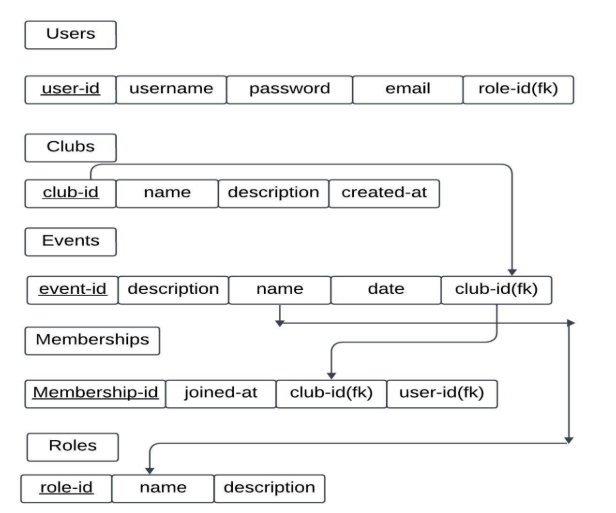

# 📌 BITCM-Club Management System

## 📖 Overview
The **BITCM-Club Management System** is a PHP & MySQL-based web application designed to **automate and streamline club administration**. 

It includes modules for **member registration, event management, attendance tracking, and financial management**, with a **secure login system** and **role-based access control** for **Bangalore Institute of Technology**.  

This system **reduces manual work**, improves operational efficiency, and fosters better member engagement through a user-friendly interface making accessiblity convinient.

---

## 🚀 Features
- **User Authentication & Role Management**  
  - Secure login for admins, moderators, and members.  
- **Member Management**  
  - Add, edit, and delete member profiles.  
  - Track active/inactive memberships.  
- **Event Management**  
  - Create, schedule, and promote events.  
  - Track event participation and attendance.  
- **Attendance Tracking**  
  - Generate reports on participation.  
- **Financial Management**  
  - Manage membership fees, income, and expenses.    
- **Communication Tools**  
  - Announcements, group chats, and direct messaging.  
- **Customizable & Scalable**  
  - Adaptable for small or large clubs.

---

## 🛠️ Tech Stack
**Frontend**
- HTML  
- CSS  
- JavaScript  
- Bootstrap  

**Backend**
- PHP 7+  
- MySQL 5.5+  

**Server Environment**
- Apache (via XAMPP or similar)

---

## 📂 Project Structure

<b>Entity-Relationship Diagram</b>

<b>Schema Diagram</b>

## 🖼️ Snapshots

  

    
<b>Login Page</b>

    
  

  

    
<b>Member Profile</b>

    
  

  

    
<b>Events Page</b>

    
  

  

    
<b>Chat Box</b>

    
  

